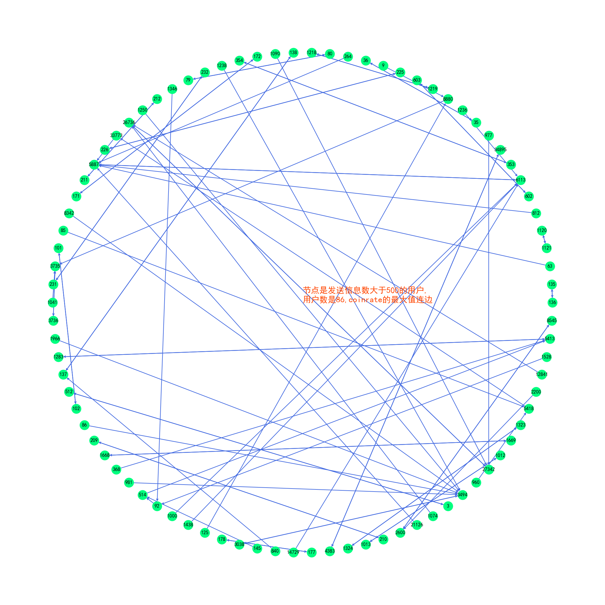
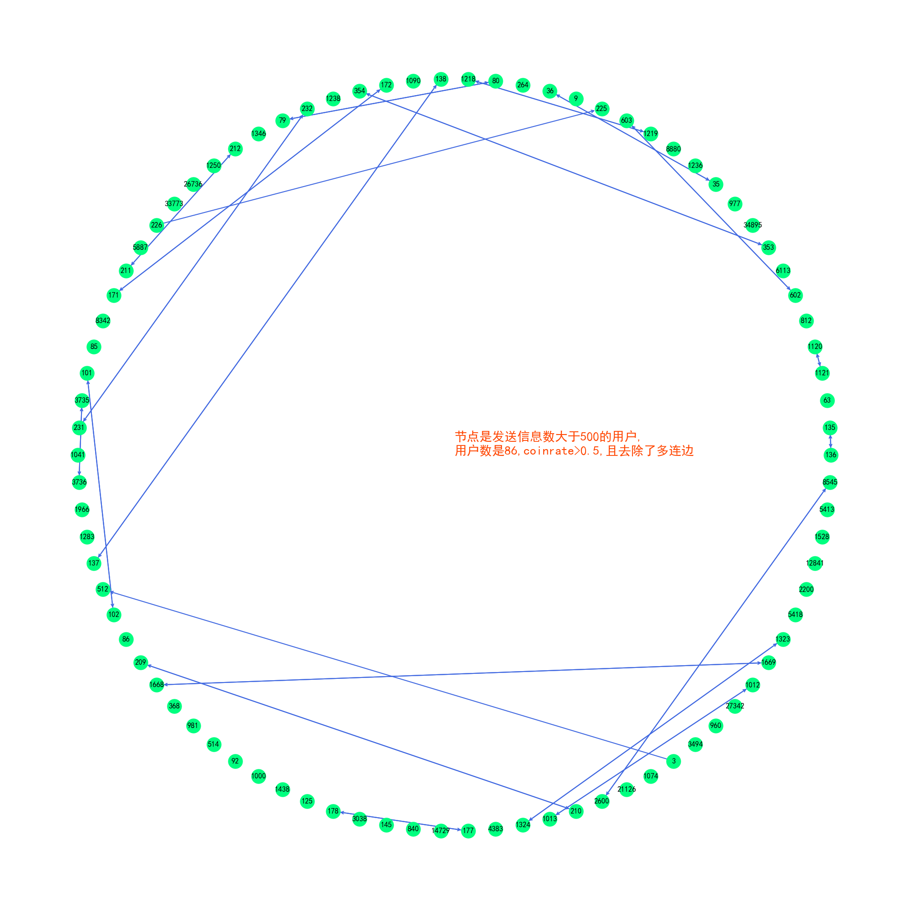
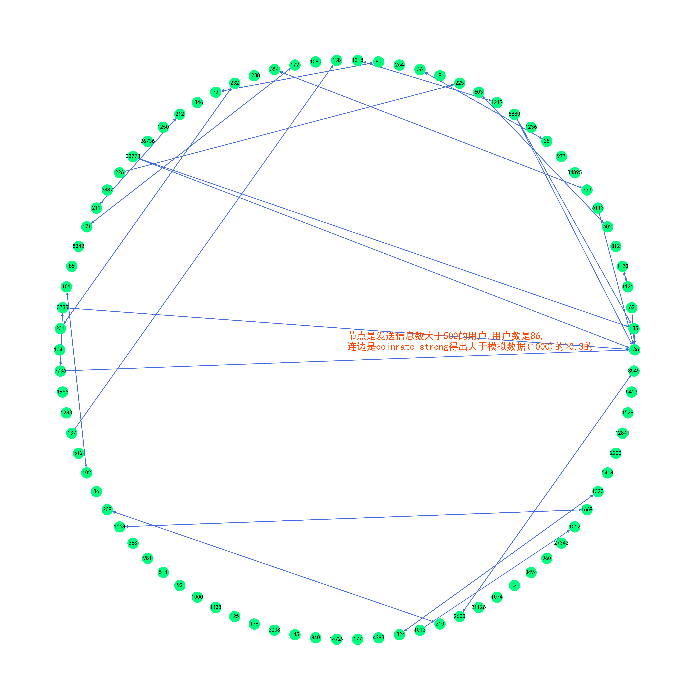
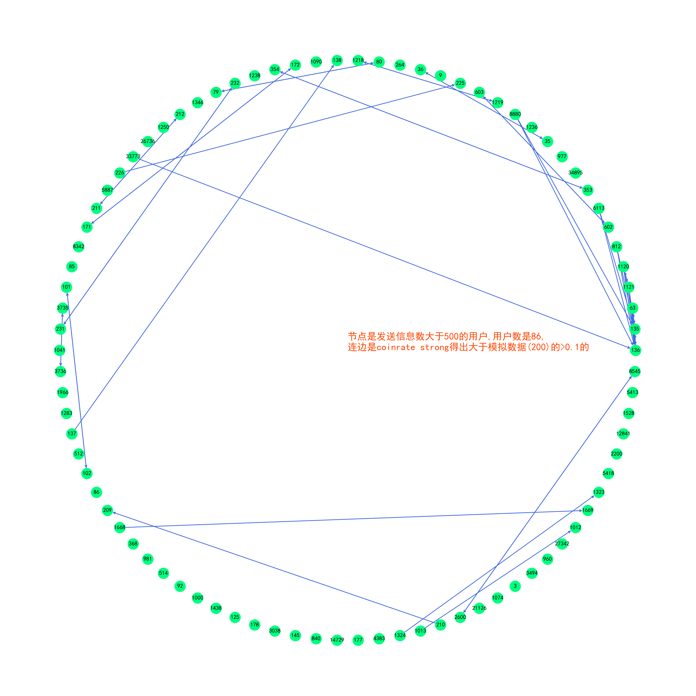
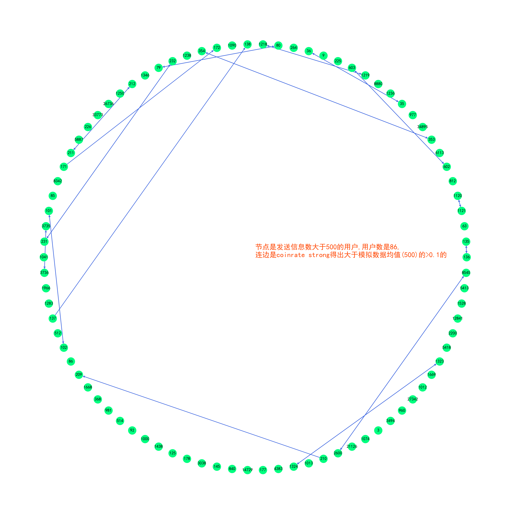
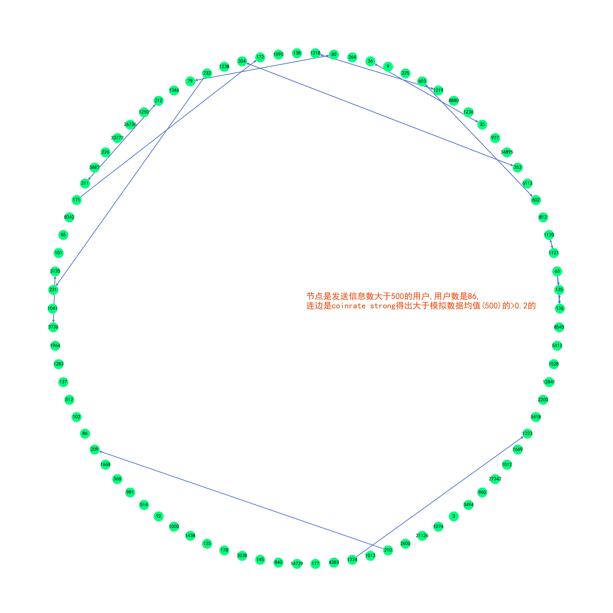
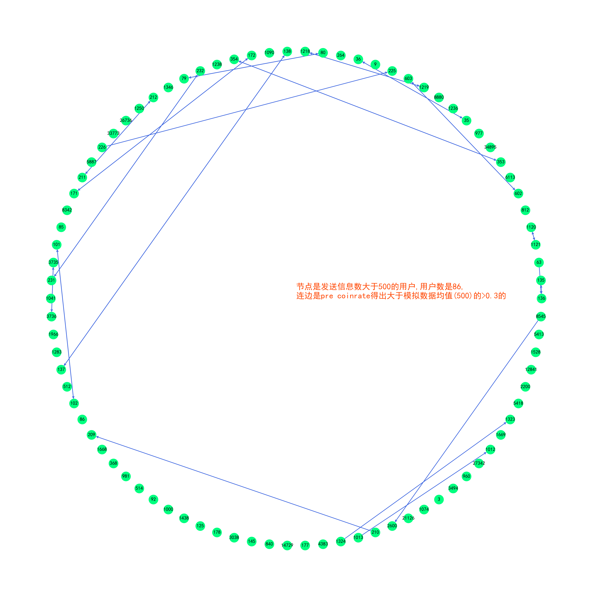
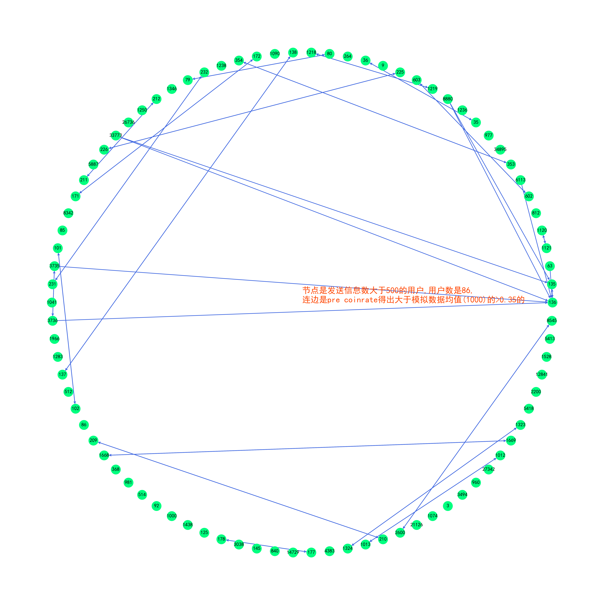

# 图片的说明

## SD01挑选发送信息大于500的对象作为节点

### coinrate的网络

绘制网络的方式一般是circular，使用的coinrate是：
$$r_{p}(\Delta T, \tau)=\frac{1}{N_{A}} \sum_{i=1}^{N_{A}} \Theta\left[\sum_{j=1}^{N_{B}} 1_{[0, \Delta T]}\left(\left(t_{i}^{A}-\tau\right)-t_{j}^{B}\right)\right]$$
其中$\Delta T=600,\tau=0$

#### coinrate>0.5

连边是计算了coinrate>0.5的数据

#### coinrate最大值

每个发信对象的coinrate的最大值对应的收信人作为一个连边

#### coinrate去除多条边

将coinrate>0.5的数据中，连接一个节点多于1个的去除，每个节点仅保留一条连边

#### coinrate>0.5 by kamada

连边是计算了coinrate>0.5的数据，使用的绘制网络的方式是kamada

### 数据的网络

数值代表的是对方接受的信息占自己发送信息的比例

#### SD01的网络 num>50%

挑选了这个比例>50%的对象作为连边

#### SD01的网络 最大的num

挑选了对方接受的信息在所考虑的对象中是最大的那一组作为连边

### coinrate strong的网络

计算的方式是circular，使用的coinrate strong是更强的联系，计算公式是：
$$r_{double}(\Delta T)=\frac{1}{N_{A}} \sum_{i=1}^{N_{A}} \Theta\left[\sum_{j=1}^{N_{B}} \left(1_{[0, \Delta T]}(t_{j-1}^{B}-t_{i}^{A})\times 1_{[0, \Delta T]}(t_{i}^{A}-t_{j}^{B})\right)\right]$$
其中$\Delta T=600$

#### coinrate strong >0.5

挑选的连边是coinrate >0.5的作为连边

#### coinrate strong >0.45

挑选的连边是coinrate >0.45的作为连边

## 模拟过滤之后的

### 将事件数量映射为1000

#### 数据均值---1000

选择coinrate strong 的数据，将相应的事件对应的数量与模拟得出的均值相比较，对获得的数据中>0.3的计算连边。

得到的网络与'SD01 num>50%'的相似度是0.7142857142857143

#### 数据均值+标准差---1000

选择coinrate strong 的数据，将相应的事件对应的数量与模拟得出的均值+标准差相比较，对获得的数据中>0.3的计算连边。

得到的网络与'SD01 num>50%'的相似度是0.6097560975609756

#### 数据均值+3*标准差---1000

由于获得的相似度不足0.5，因此没有保存

### 将事件数量映射为200

#### 数据均值---200

选择coinrate strong 的数据，将相应的事件对应的数量与模拟得出的均值相比较，对获得的数据中>0.1的计算连边。

得到的网络与'SD01 num>50%'的相似度是0.5714285714285714

#### 数据均值+标准差---200

由于获得的相似度不足0.2，因此没有保存

#### 数据均值+3*标准差---200

由于获得的相似度不足0.2，因此没有保存

### 将事件数量映射为500

#### 数据均值---500

选择coinrate strong 的数据，将相应的事件对应的数量与模拟得出的均值相比较，对获得的数据中>0.3的计算连边。

得到的网络与'SD01 num>50%'的相似度是0.7073170731707317

#### 数据均值+标准差---500

选择coinrate strong 的数据，将相应的事件对应的数量与模拟得出的均值相比较，对获得的数据中>0.3的计算连边。

得到的网络与'SD01 num>50%'的相似度是0.5116279069767442

#### 数据均值+3*标准差---500

由于获得的相似度不足0.3，因此没有保存

### pre coinrate 将事件数量映射为200

#### pre 数据均值---200

由于获得的相似度不足0.5，因此没有保存

#### pre 数据均值+标准差---200

由于获得的相似度不足0.2，因此没有保存

#### pre 数据均值+3*标准差---200

由于获得的相似度不足0.1，因此没有保存

### pre coinrate 将事件数量映射为500

#### pre 数据均值---500

选择pre coinrate 的数据，将相应的事件对应的数量与模拟得出的均值相比较，对获得的数据中>0.3的计算连边。

得到的网络与'SD01 num>50%'的相似度是0.7380952380952381

#### pre 数据均值+标准差---500

由于获得的相似度不足0.4，因此没有保存

#### pre 数据均值+3*标准差---500

由于获得的相似度不足0.2，因此没有保存

### pre coinrate 将事件数量映射为1000

#### pre 数据均值---1000

选择pre coinrate 的数据，将相应的事件对应的数量与模拟得出的均值相比较，对获得的数据中>0.35的计算连边。

得到的网络与'SD01 num>50%'的相似度是0.8780487804878049

#### pre 数据均值+标准差---1000

选择pre coinrate 的数据，将相应的事件对应的数量与模拟得出的均值相比较，对获得的数据中>0.25的计算连边。

得到的网络与'SD01 num>50%'的相似度是0.7142857142857143

#### pre 数据均值+3*标准差---1000

由于获得的相似度不足0.4，因此没有保存