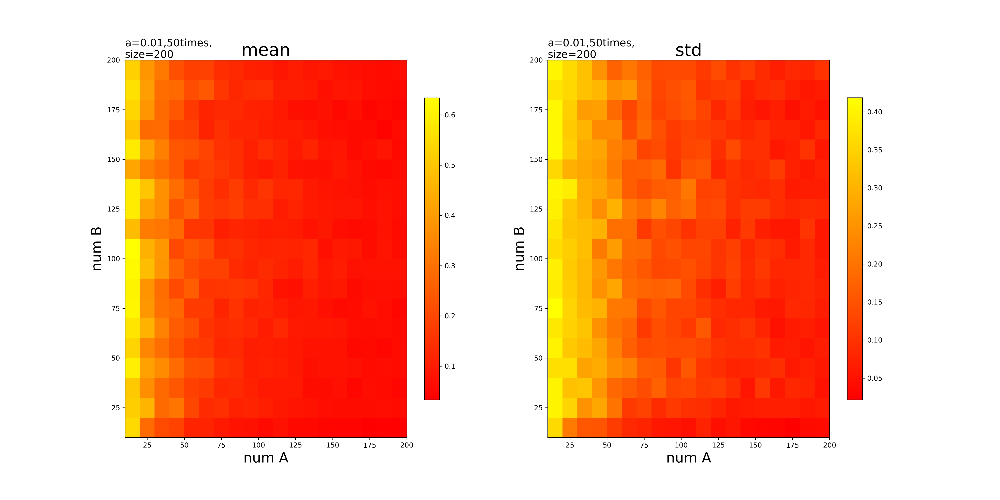
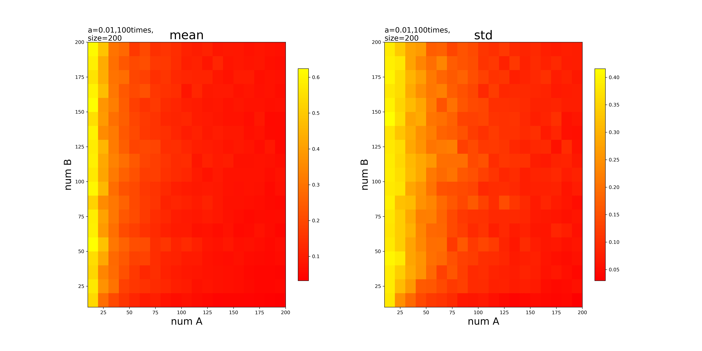
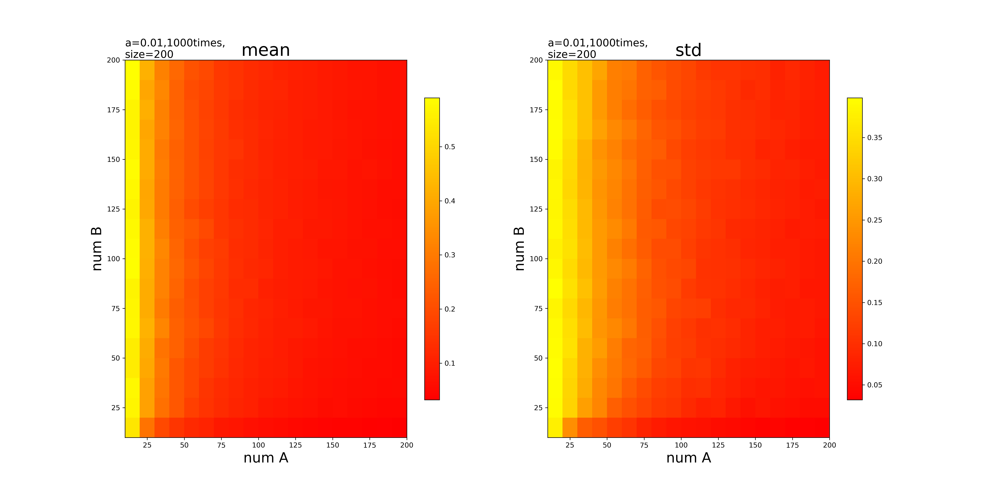
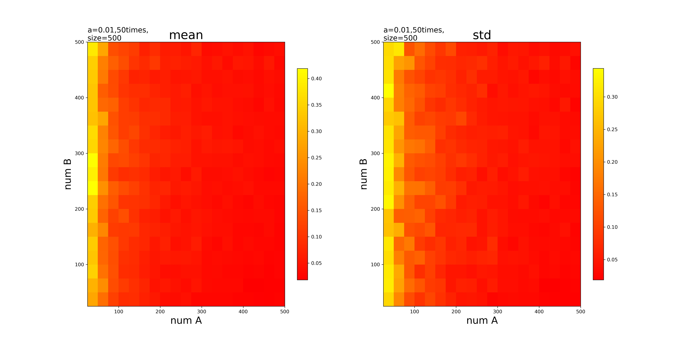
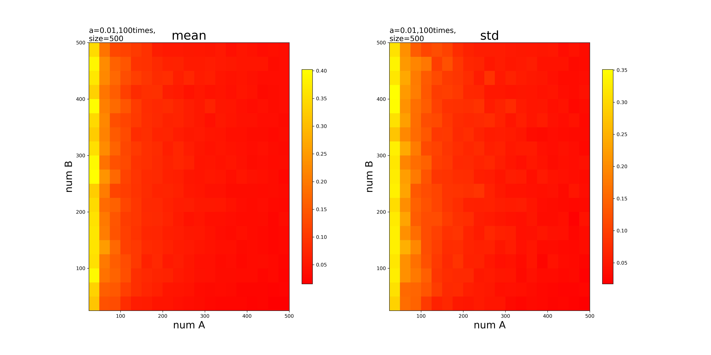
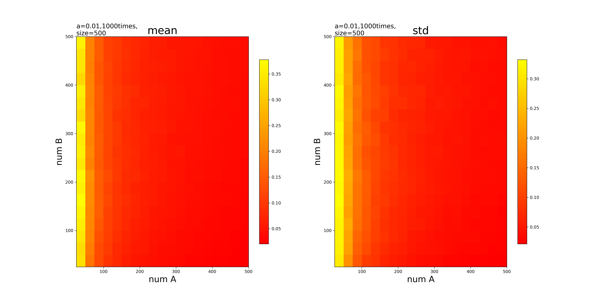
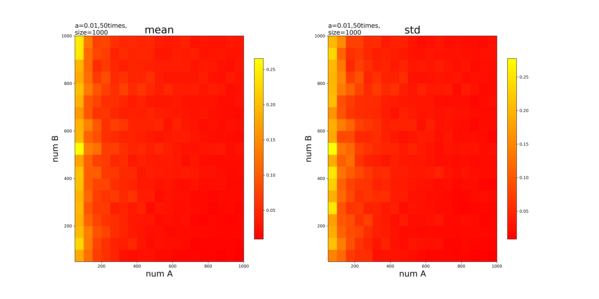
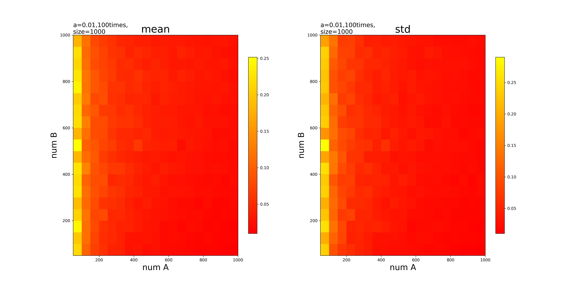
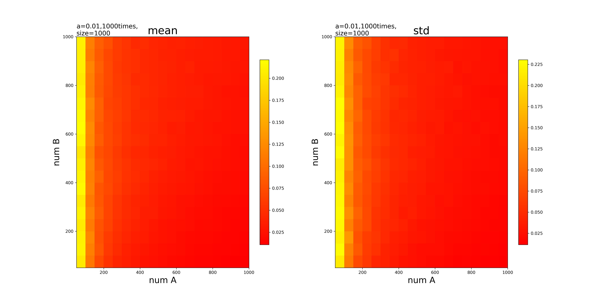

# 模拟的数据

## coinrate strong

### 幂律分布-200个事件

```python
stats.powerlaw.rvs(a=0.01,loc=10,scale=8e4,size=200)
```

#### 模拟50次求平均标准差-200



#### 模拟100次求平均标准差-200



#### 模拟1000次求平均标准差-200



#### 模拟1000次的数据-200

x轴是事件A，y轴是事件B，计算的每个结果是事件A对事件B的巧合率

均值：
<./mul_1000t_sd_crstrong_200_mean.txt>

标准差
<./mul_1000t_sd_crstrong_200_std.txt>

### 幂律分布-500个事件

```python
stats.powerlaw.rvs(a=0.01,loc=10,scale=8e4,size=500)
```

#### 模拟50次求平均标准差-500



#### 模拟100次求平均标准差-500



#### 模拟1000次求平均标准差-500



#### 模拟1000次的数据-500

x轴是事件A，y轴是事件B，计算的每个结果是事件A对事件B的巧合率

均值：
<./mul_1000t_sd_crstrong_500_mean.txt>

标准差
<./mul_1000t_sd_crstrong_500_std.txt>

### 幂律分布-1000个事件

```python
stats.powerlaw.rvs(a=0.01,loc=10,scale=8e4,size=1000)
```

#### 模拟50次求平均标准差-1000



#### 模拟100次求平均标准差-1000



#### 模拟1000次求平均标准差-1000



#### 模拟1000次的数据-1000

x轴是事件A，y轴是事件B，计算的每个结果是事件A对事件B的巧合率

均值：
<./mul_1000t_sd_crstrong_1000_mean.txt>

标准差
<./mul_1000t_sd_crstrong_1000_std.txt>

