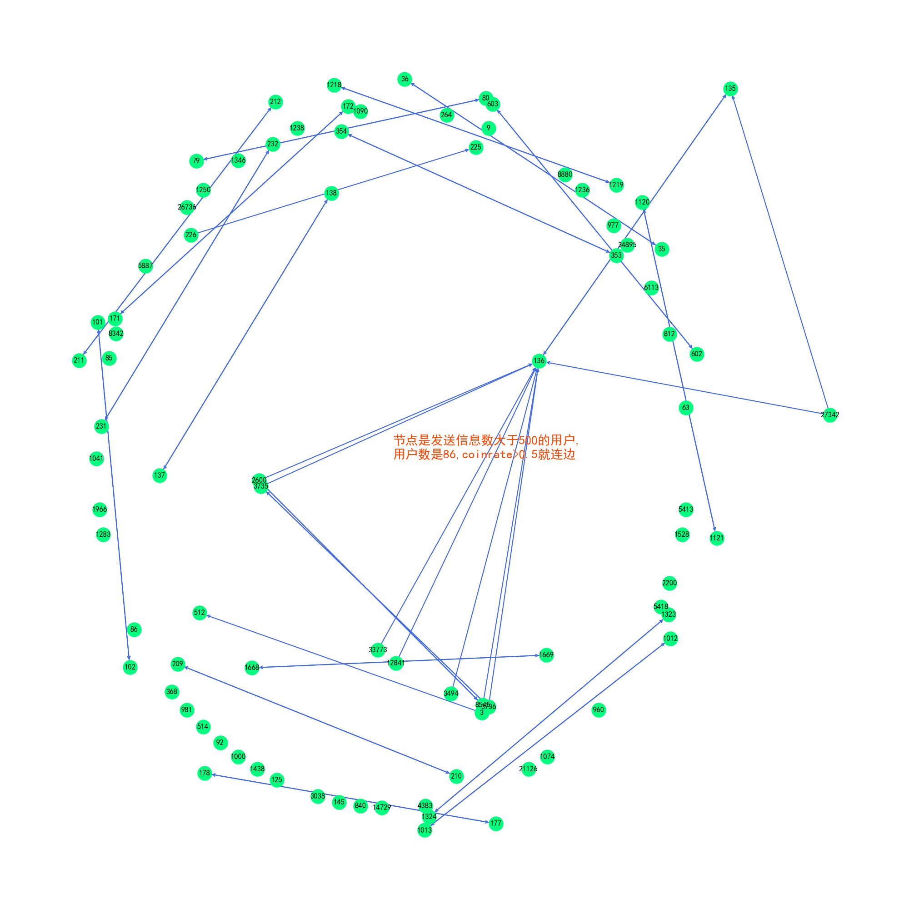
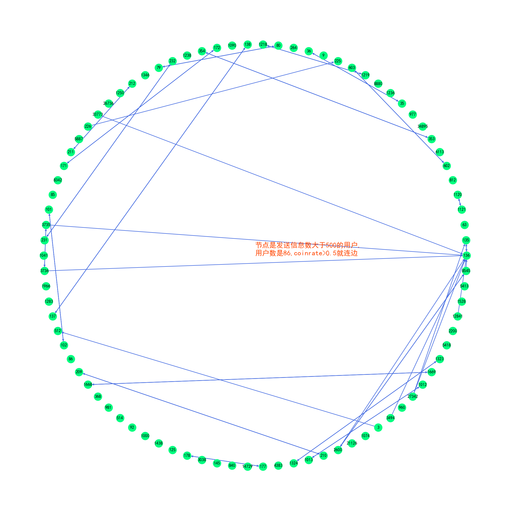
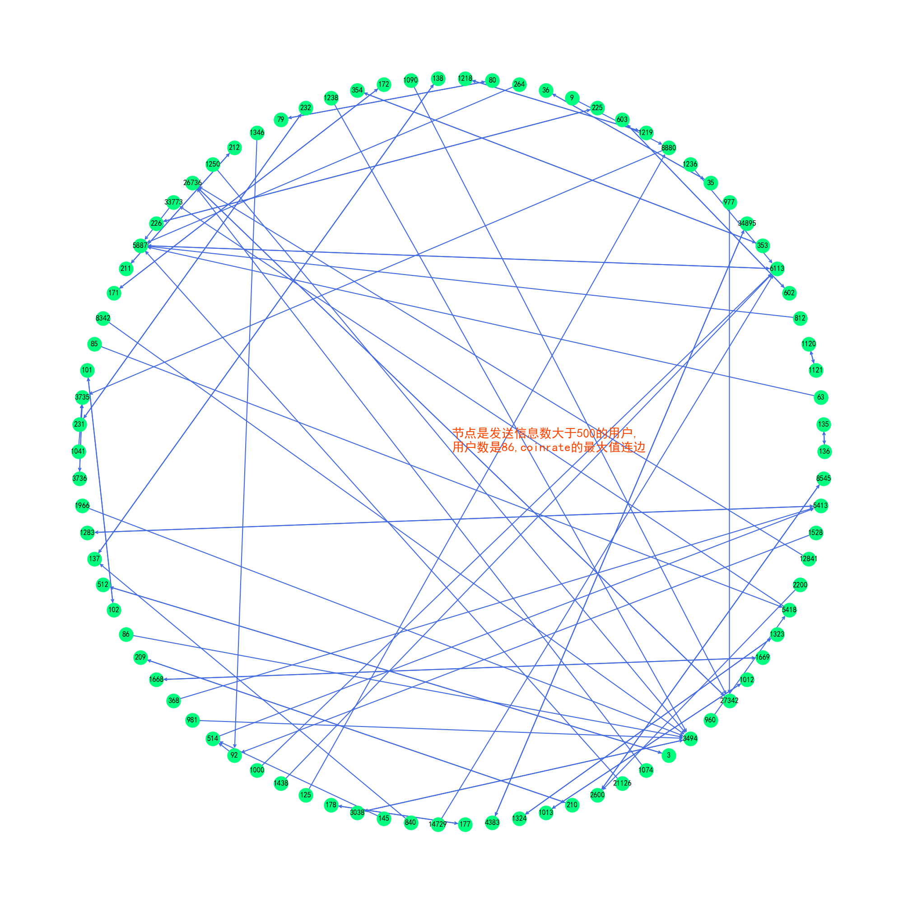
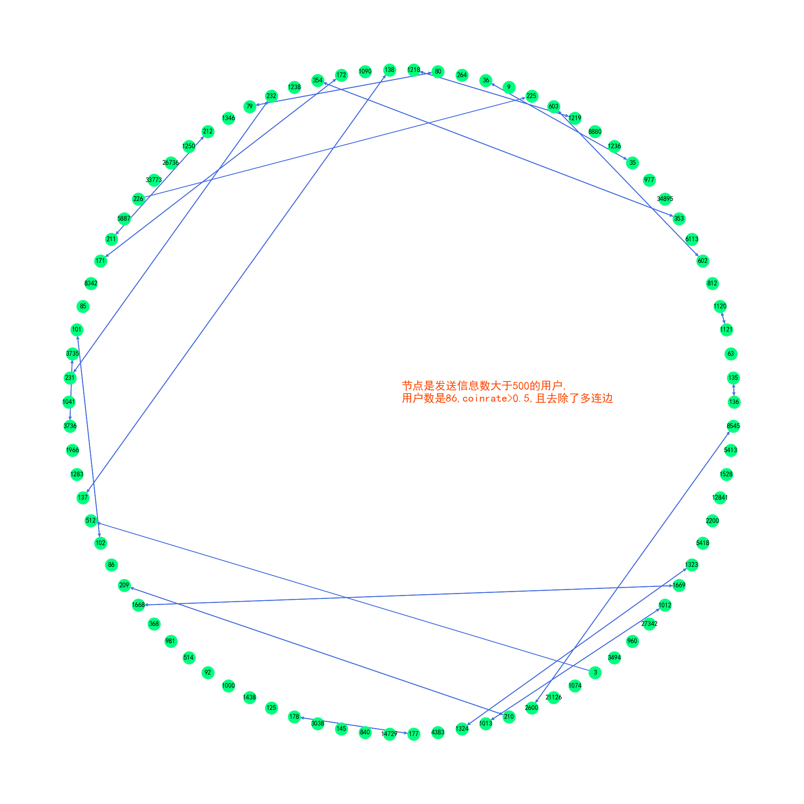
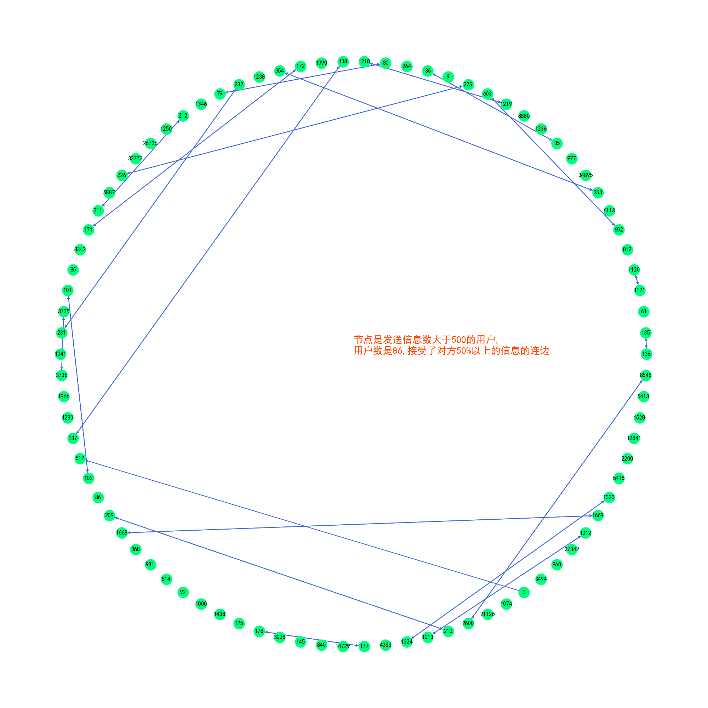
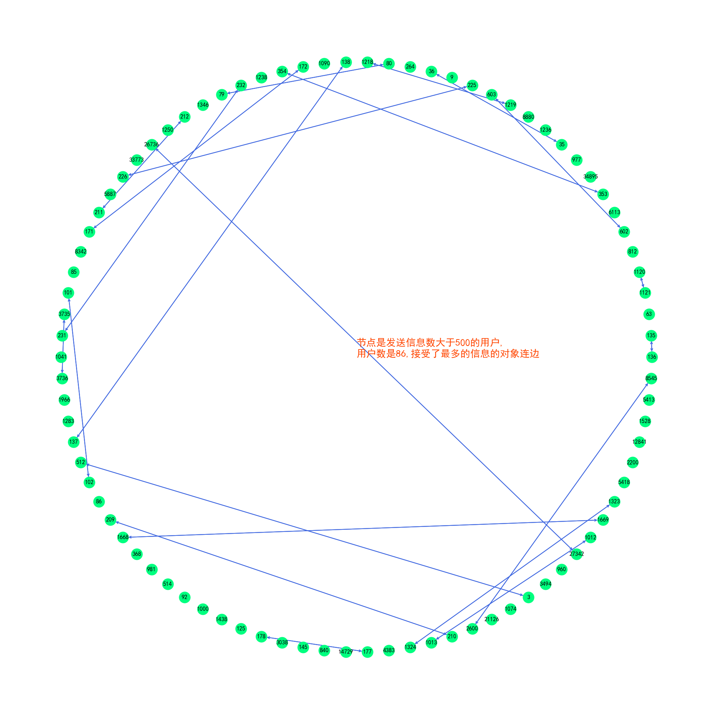

# 数据分析

为了分析coin rate而编写python程序，作为毕业论文的课题。

## 随机数据

文件中包括了对随机数据的模拟，随机数据计算其coin rate。

## 文献的数据

分析文献中的SD数据（来自公司员工的短信息交流数据）。

## 绘制网络

### coin rate

coin rate的结果绘制为网络图，包括了挑选：

1. cr>0.5的作为连边的两种不同排列类型的图

1. cr最大的对象的连边

3. cr>0.5的作为连边且保留每个节点最大的边

一共4张图  

### SD 数据

来自文献的SD01数据：

1. 挑选收信比例>50%的对象，连边

2. 挑选收信比例为所有对象的最大值的连边

一共2张图

### 网络的相似性

>定义网络的相似性：连边集合1和连边集合2的交集与并集的比例作为网络的相似性的度量
>$$sim=\frac{edg1\cap edg2}{edg1\cup edg2}$$

由此可以得出上列网络图中的不同网络的相似度  

| 相似度 |cr.5|cr_max|cr.5_re|data.5|data_max|
| :----- | :-----: | :-----: | :-----: | :-----: | :-----: |
|cr.5|1.00|0.42|0.82|0.80|0.75|
|cr_max|0.42|1.00|0.47|0.48|0.51|
|cr.5_re|0.82|0.47|1.00|0.98|0.91|
|data.5|0.80|0.48|0.98|1.00|0.93|
|data_max|0.75|0.51|0.91|0.93|1.00|

值得注意的是(cr.5_re)与(data.5)的相似度达到了0.98，这表明这两个网络基本相同而(cr.5_re)是依据coin rate得出的网络，而(data.5)是依据SD01数据直接画出的网络，这两个网络的形成方式不同，却有高度的相似性，这表明coin rate作为衡量社交网络的方法非常接近实际情况